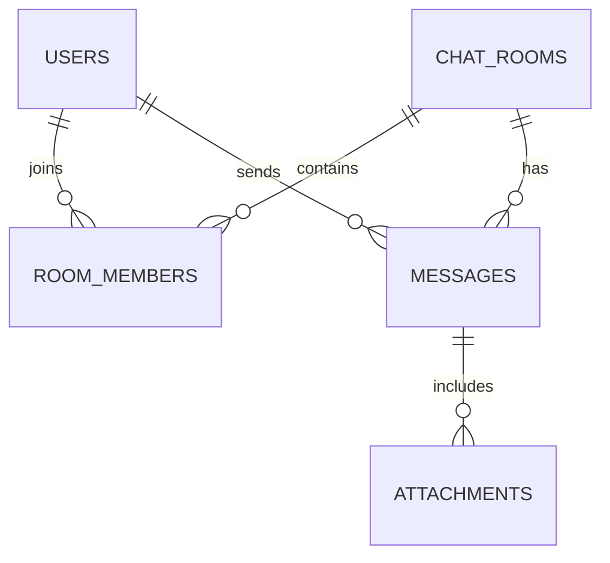

# Chuong 02 - Domain va database design

## Muc tieu

Thiet ke model toi thieu cho chat 1-1 va chat nhom. Sau chuong nay, ban co migration dau tien va entity JPA tuong ung.

## Can hieu

Chat app khong chi co bang `messages`. Can biet ai la user, phong nao ton tai, ai nam trong phong, tin nhan thuoc phong nao.

Model toi thieu:

- `users`: tai khoan nguoi dung.
- `chat_rooms`: phong chat, co loai `DIRECT` hoac `GROUP`.
- `room_members`: quan he user - room.
- `messages`: noi dung tin nhan.
- `attachments`: file gan voi message.

## Bai thuc hanh

### 1. Ve ERD bang Mermaid

Tao file note rieng hoac dat trong README:



### 2. Tao migration Flyway

Tao `backend/src/main/resources/db/migration/V1__init_chat_schema.sql`.

Khung SQL goi y:

```sql
create table users (
    id bigint primary key auto_increment,
    username varchar(50) not null unique,
    email varchar(120) not null unique,
    password_hash varchar(255) not null,
    display_name varchar(100) not null,
    created_at timestamp not null,
    updated_at timestamp not null
);

create table chat_rooms (
    id bigint primary key auto_increment,
    type varchar(20) not null,
    name varchar(120),
    created_by bigint not null,
    created_at timestamp not null,
    updated_at timestamp not null
);
```

Tu viet tiep `room_members`, `messages`, `attachments`. Hay dat foreign key ro rang de database bao ve du lieu.

### 3. Tao entity theo tung nhom

Goi y package:

```text
vn.chatapp.demo.user
vn.chatapp.demo.room
vn.chatapp.demo.message
```

Entity nen extend `BaseEntity` neu project da co class nay. Viec nay giup tranh lap lai `createdAt`, `updatedAt`.

### 4. Tao enum

Can it nhat:

```java
public enum RoomType {
    DIRECT,
    GROUP
}

public enum MessageType {
    TEXT,
    FILE,
    SYSTEM
}
```

## Tu kiem tra

- Flyway tao duoc schema trong MySQL.
- Entity map dung voi table name.
- Ban co the giai thich vi sao chat 1-1 van nen la mot `chat_room` thay vi bang rieng.

## Loi hay gap

- Dung ten table `user`: day la tu de gay xung dot. Nen dung `users`.
- De cascade qua rong giua room va user.
- Luu file binary truc tiep trong MySQL qua som. O khoa nay chi luu metadata.

